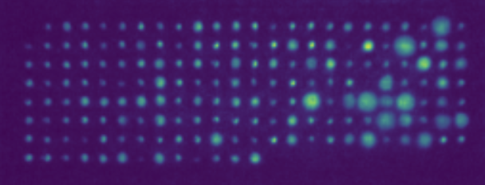

# Fluorescence


<!-- List of todos -->

This python package is for computing simple image statistics of fluorescence images captured by the Fluopam device.

## TODO 

* create requirements.txt [ ]
* create a package [ ]
* create install instructions [ ]
* deploy the package [ ]


### Citing this work

```
@inproceedings{fluorescence,
          title={{Fluorescence: a data analysis software for micro-algeas captured by Fluopam}},
          author={Groueix, Thibault and Burlacot, Adrien},
          year={2023}
        }
```
